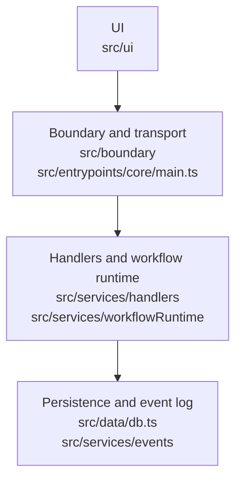

# PhotoStar Architecture

## Purpose

This document is the canonical architecture reference for PhotoStar.

PhotoStar now uses the workflow runtime as its only workflow orchestration
system. The older queue-driven orchestration stack has been removed.

## Design Principles

- Keep UI, boundary, services, and data concerns separate.
- Treat transport and host-specific behavior as adapter concerns.
- Keep workflow execution explicit and inspectable through persisted runtime
  state.
- Prefer workflow definitions, modules, and projections over hidden orchestration
  state.
- Delete stale compatibility layers instead of documenting coexistence.

## Core Concepts

| Term | Meaning |
| --- | --- |
| `asset` | The persisted library record for a managed media file. |
| `workflow runtime` | The orchestration system built around `workflow_runs`, `step_runs`, `subject_executions`, and workflow milestones. |
| `workflow` | A declarative definition of modules and control nodes that describe a run. |
| `module` | A runtime execution unit that reads persisted state, writes outputs, and returns typed artifacts. |
| `job` | Progress and lifecycle tracking for long-running work. |
| `event` | An append-only fact pushed to the event log and frontend projections. |

## Logical Layers

| Layer | Responsibility | Current implementation |
| --- | --- | --- |
| UI | Renders state, collects intent, and presents workflow oversight. | `src/ui/` |
| Boundary | Defines contracts, transport, and message handling between UI and backend. | `src/boundary/`, `src/entrypoints/core/main.ts` |
| Services | Handles commands, executes workflow definitions, and projects runtime state. | `src/services/handlers/`, `src/services/workflowRuntime/` |
| Data | Stores catalog state, workflow runtime state, job history, and recent events. | `src/data/db.ts`, `src/services/events/` |

## Deployment Modes

The same logical architecture is used across local desktop and networked
runtime modes.

| Mode | Transport | Notes |
| --- | --- | --- |
| Packaged desktop | Tauri IPC / sidecar process | Local companion backend with local storage and image access. |
| Desktop dev runtime | WebSocket + local HTTP image bridge | Optimized for iteration speed. |
| LAN or hosted runtime | WebSocket + HTTP image requests | Same backend command/runtime model, different host packaging. |

## Workflow Runtime

The workflow runtime is the single orchestration path for PhotoStar workflows.

### Persisted runtime state

- `workflow_runs`
- `workflow_run_milestones`
- `step_runs`
- `subject_executions`

These tables are the source of truth for workflow oversight, drill-down views,
and dashboard summaries.

### Current workflow families

- `folder_ingest_v1`
- `library_grouping_v1`
- `library_previews_v1`
- `library_face_pipeline_v1`
- `library_sensitive_scan_v1`
- `library_ai_metadata_v1`

### Runtime command surface

Workflow execution is launched through runtime-native backend commands such as:

- `start_folder_ingest`
- `start_library_grouping`
- `start_library_preview_workflow`
- `start_library_face_workflow`
- `start_library_sensitive_scan_workflow`
- `start_library_ai_metadata_workflow`
- `start_workflow_run`

### Dashboard model

The dashboard is runtime-native and is built from:

- workflow run lists
- milestone summaries
- per-workflow status aggregates
- recent events
- data coverage metrics
- processing issue summaries

It does not expose queue stages, paused modules, or removed legacy control
state.

## Persistence Overview

Key persisted concerns:

- `assets`, `previews`, `derived_results`
- `people`, `face_assignments`, manual overrides
- grouping and album tables
- `jobs`, `events`, `processing_issues`
- workflow runtime tables listed above
- `settings` for small operational preferences

Legacy queue tables and removed workflow-system settings are not part of the
current architecture.

## Summary

PhotoStar has one workflow orchestration model: the workflow runtime. The UI,
boundary, service, and data layers are kept separate so deployment packaging can
change without changing core workflow behavior.
