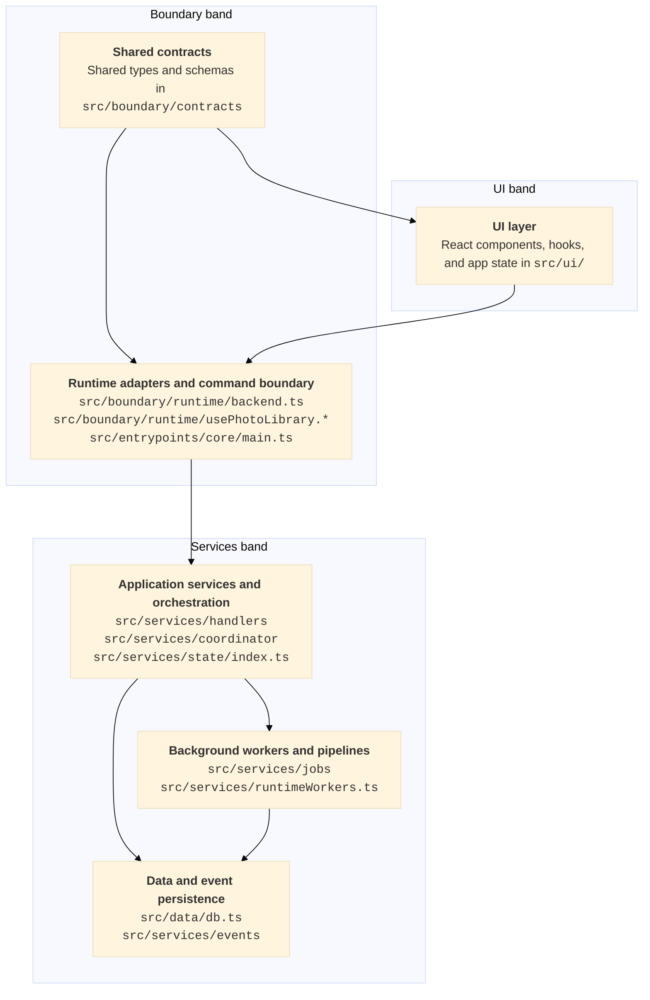
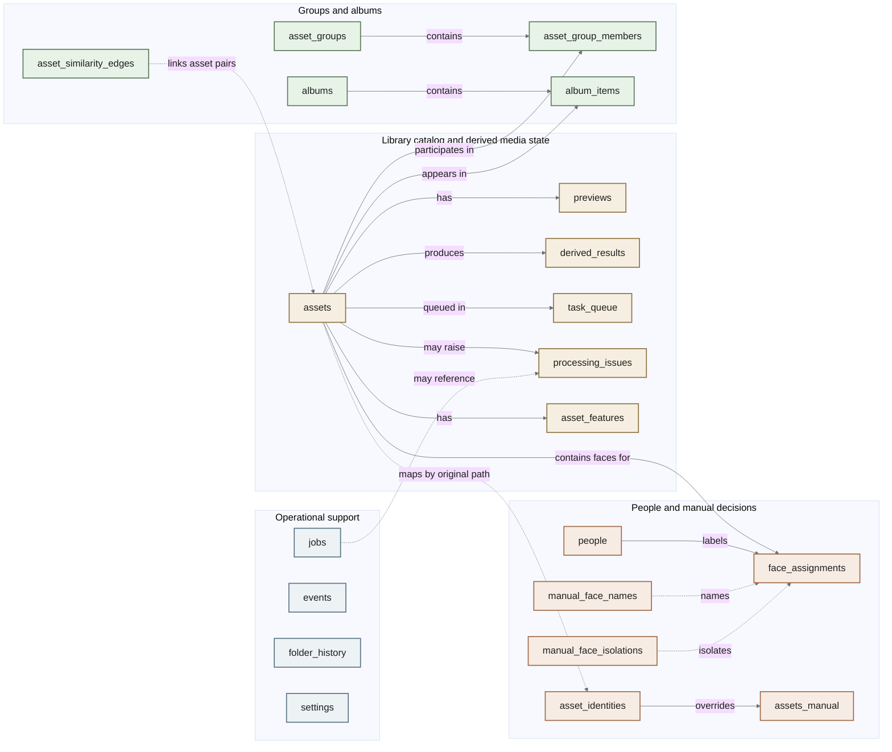
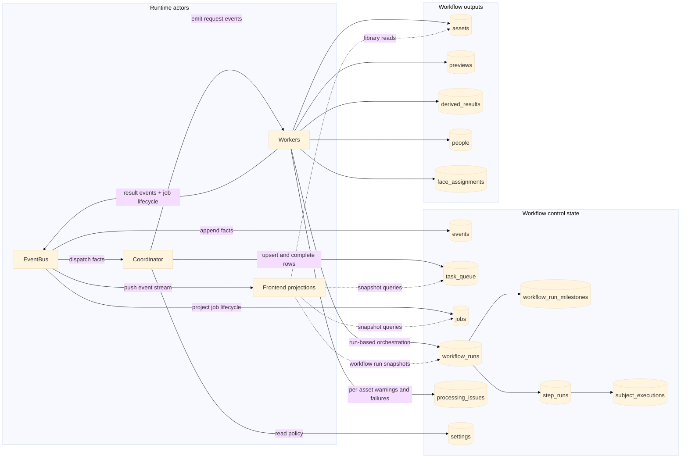
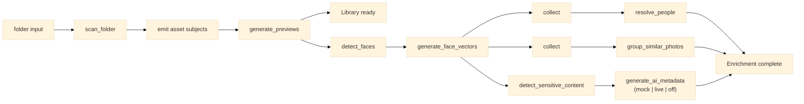
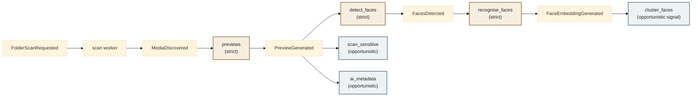
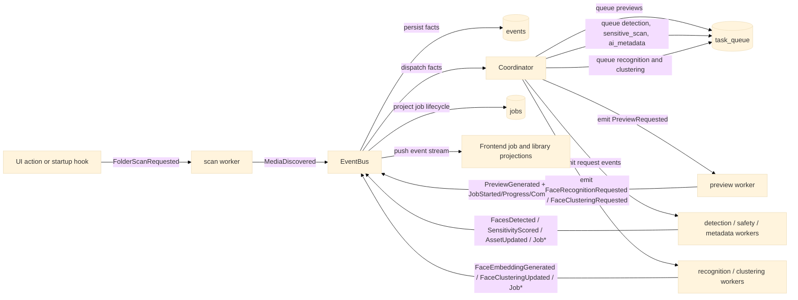

# PhotoStar Architecture

## Purpose

This document is the single canonical architecture reference for PhotoStar.

It separates two concerns that should not be mixed together:

1. the logical code layers in PhotoStar
2. the deployment modes that package and connect those layers in a specific
   runtime

Most application logic should stay agnostic about where it is running and how
messages move between layers. Deployment-specific branching should be isolated
to runtime adapters, transport setup, and host-specific optimizations such as
native file picking or local image URL resolution.

## Design Principles

- Keep the same logical layers across desktop, LAN, and cloud deployments.
- Treat transport choice as an adapter concern, not an application concern.
- Keep the UI focused on rendering state and dispatching user intent.
- Centralize command parsing, response shaping, and transport selection.
- Run long-lived or heavy work in backend workers and stream progress/events.
- Let the data layer own persistence details so storage can evolve separately
  from the rest of the application.
- Keep one architecture source of truth in the repo. Delete stale duplicates
  rather than letting them drift.

## Core Concepts

| Term | Canonical meaning |
| --- | --- |
| `asset` | The technical persisted umbrella entity for any managed media file. The current schema stores library records in the `assets` table. |
| `photo` | The current primary human-facing asset subtype. Users mostly experience PhotoStar as a photo library, even though the architecture keeps room for other asset types. |
| `media` | The workflow and event term used for processing-oriented identifiers such as `mediaId`. |
| `sidecar` | A deployment-specific term for the packaged Tauri desktop implementation where the app spawns a local Node companion process. It is not the generic name for the services layer. |
| `backend` / `core service` | The generic runtime service layer across LAN, cloud, and other non-packaged deployments. |
| `workflow` | A declarative set of stage policies and event reactions that describe what processing should happen next. |
| `event` | An append-only fact or request in the workflow system, such as `MediaDiscovered`, `PreviewGenerated`, or `FaceDetectionRequested`. |
| `job` | A runtime execution and monitoring concept used for progress reporting and lifecycle projection. |
| `task` | A smaller unit of queued or batched work within a stage. In practice this is often tracked through `task_queue` rows plus worker-owned batches. |
| `coordinator` | The orchestration component that reacts to events, updates queue state, and dispatches request events to workers. |
| `workflow runtime` | The newer explicit run-based orchestrator centered on `workflow_runs`, `step_runs`, and `subject_executions`. It now owns the main `folder_ingest_v1` runtime path. |

## Logical Code Layers

The architecture has three horizontal bands: UI, boundary/adapters, and
services/data. The middle band exists to keep deployment and transport concerns
out of both the UI and the core business logic.

| Band | Layer | Responsibility | Current implementation |
| --- | --- | --- | --- |
| UI | UI layer | Renders state, manages interaction state, and issues user intents. It should not perform filesystem access, database access, or workflow execution. | `src/ui/components/`, `src/ui/hooks/`, `src/ui/App.tsx` |
| Boundary | Shared contracts | Defines shared message shapes, domain types, and schemas used on both sides of the command boundary. | `src/boundary/contracts/core.ts`, `src/boundary/contracts/jobs.ts`, `src/boundary/contracts/schemas.ts` |
| Boundary | Runtime adapters and command boundary | Chooses transport, resolves image URLs, normalizes request/response handling, parses incoming commands, and routes work into backend handlers. | `src/boundary/runtime/backend.ts`, `src/boundary/runtime/usePhotoLibrary.connection.ts`, `src/boundary/transport/usePhotoLibrary.transport.ts`, `src/entrypoints/core/main.ts`, `src/services/handlers.ts` |
| Services | Application services and orchestration | Turns commands and events into queue mutations, workflow decisions, and backend behavior. | `src/services/handlers/*.ts`, `src/services/coordinator/*.ts`, `src/services/state/index.ts` |
| Services | Background workers and pipelines | Performs scanning, preview generation, face workflows, grouping, safety analysis, and AI metadata work. | `src/services/jobs/*.ts`, `src/services/runtimeWorkers.ts` |
| Services | Data and event persistence | Stores library state, queue state, job history, derived outputs, grouping state, albums, settings, and the event log. | `src/data/db.ts`, `src/services/events/bus.ts` |

## Layer Boundaries

### UI layer

The UI is a client of the backend boundary. It can detect host capabilities, but
it should not absorb backend responsibilities such as filesystem traversal,
SQLite queries, or workflow execution.

### Boundary band

The boundary band is where deployment-specific concerns live:

- `src/boundary/runtime/backend.ts` selects deployment mode, transport kind, backend
  origin, and image URL strategy.
- `src/boundary/runtime/usePhotoLibrary.connection.ts` chooses between a Tauri companion
  process and a WebSocket backend connection.
- `src/boundary/transport/usePhotoLibrary.transport.ts` normalizes request/response handling
  across stdio and WebSocket transports.
- `src/entrypoints/core/main.ts` parses inbound JSON commands and hands them off to backend
  handlers.

Most other frontend code should not care whether it is talking over child
process stdio, `ws://`, or `wss://`.

### Services band

Handlers, the coordinator, workers, and persistence should not need to know
whether the caller came from a Tauri desktop app, a LAN browser session, or a
cloud deployment. They should operate in terms of commands, events, jobs, and
persisted entities instead.

Today the data layer is centered on SQLite via `src/data/db.ts`. That is the
current storage implementation, not the architectural boundary itself. A future
cloud deployment can move some or all persistence into managed databases or
object storage while preserving the same logical entities and service
interfaces.

## Deployment Modes

Deployment modes describe how the same logical layers are split, packaged, and
wired together for a specific environment.

| Mode | Packaging and wiring | Transport and image strategy | Notes |
| --- | --- | --- | --- |
| Packaged desktop | React SPA runs inside a Tauri WebView. The backend runs as a bundled Node sidecar companion process. The current data store lives on the local machine. | JSON messages flow over sidecar stdio. Local images use Tauri `convertFileSrc()` and the native `asset://` path strategy. | This is the main case where the term `sidecar` is precise and useful. |
| Desktop dev runtime | The UI still runs in the Tauri shell, but the backend is a watched local Node process during development. | Frontend connects over local WebSocket and uses the local HTTP `/image` endpoint. | Optimized for development speed rather than packaged fidelity. |
| LAN or headless server | The UI runs in a browser while the same backend logic runs on a local machine, NAS, or always-on host with photo access. | Frontend uses `ws://` plus HTTP image requests to the backend host. | Good for multi-device access on the same network without changing the logical layers. |
| Cloud target | The UI can be statically hosted while services run in Node on a VM or container. Data can stay in SQLite on attached storage for small installs or move to a cloud database and object storage for larger ones. | Frontend uses `wss://` and `https://`, with transport and origin selected by runtime config. | Host-specific features become optional adapters, not assumptions baked into the domain logic. |

## Current Deployment Selection Rules

The frontend runtime resolves deployment in one place:

- Tauri host plus IPC transport resolves to `tauri` mode.
- `VITE_BACKEND_URL` resolves to `cloud` mode.
- Everything else falls back to `lan` mode.

That decision then drives transport and image behavior:

- `ipc` plus Tauri host uses a local companion process and `asset://` image
  URLs.
- `ws` uses backend origins derived from `VITE_BACKEND_URL` or
  `window.location.hostname`.
- Cloud transport upgrades to `wss://` and `https://`.

This keeps deployment-aware logic centralized instead of scattering
environment-specific branching across the UI and service code.

## Host-Specific Exceptions

The goal is deployment-agnostic code, but a few host-aware optimizations are
expected:

- native directory picking is only available in Tauri-hosted flows
- local image resolution uses `convertFileSrc()` in Tauri IPC mode
- local development can prefer WebSocket and HTTP bridges to avoid rebuilding
  the packaged desktop companion on every backend change

Those exceptions should stay isolated to adapters instead of leaking into
feature logic.

## Current Data Model

The current persistence implementation is defined in `src/data/db.ts`.

The key human-facing point is: photos are currently represented as rows in the
`assets` table. `assets` is the top-level library catalog. The architecture
keeps that entity broad enough to support future asset subtypes such as video,
even though the current schema does not yet model typed sub-entities.

The diagram below groups related tables by concern instead of raw SQL
declaration order so the layout stays readable at document scale.

| Table | What it does |
| --- | --- |
| `assets` | Canonical library record for each discovered asset. Today these rows are effectively the photo catalog users browse. |
| `asset_identities` | Stable identity map keyed by original path so manual decisions can survive resets or re-imports. |
| `assets_manual` | Manual overrides for asset-level moderation state, keyed by `asset_identities.guid`. |
| `events` | Persistent event log written by the event bus for auditing, debugging, and recent activity views. |
| `jobs` | Runtime and historical record of long-running jobs, including progress, throughput, error counts, and timestamps. |
| `workflow_runs` | Top-level persisted runtime executions for the new workflow runtime, including input subjects and run parameters. |
| `workflow_run_milestones` | User-facing milestone state for workflow runtime executions such as `Library ready` and `Enrichment complete`. |
| `step_runs` | Per-node execution records within a workflow runtime run. |
| `subject_executions` | Per-subject execution records within a workflow runtime step. |
| `previews` | Generated preview files for each asset and preview size. |
| `derived_results` | Generic store for machine-generated outputs such as detections, recognition data, and AI metadata, versioned by task and provider. |
| `people` | Known or inferred people entities used by face assignment and people views. |
| `face_assignments` | Links a face index within an asset to a resolved person identity, including confidence. |
| `folder_history` | Remembers previously scanned folders and their last scan times. |
| `processing_issues` | Diagnostic records for asset-specific failures or warnings during pipeline work. |
| `manual_face_names` | User-supplied face naming overrides keyed by original path and face index. |
| `manual_face_isolations` | Records manual decisions to isolate a face from a previous person association. |
| `task_queue` | Scheduler queue for pipeline stages per asset, including pending, processing, completed, and failed states. |
| `settings` | Small key-value store for runtime flags, workflow settings, and operational preferences. |
| `asset_groups` | Top-level grouping entities such as duplicates, near duplicates, burst sets, variant sets, and people-centric groups. |
| `asset_group_members` | Membership table that connects assets to a group and records roles, rank, and evidence. |
| `asset_similarity_edges` | Pairwise similarity graph between assets, including score, kind, and algorithm version. |
| `asset_features` | Cached low-level asset fingerprints such as perceptual hashes used by grouping and similarity logic. |
| `albums` | User-defined or rule-based albums, including optional cover assets and smart album rules. |
| `album_items` | Membership table that connects assets to albums. |

## Workflow, Jobs, And Events Subsystem

The workflow subsystem is how PhotoStar keeps the library visible quickly while
progressively enriching it in the background.

At the moment there are two orchestration paths in the codebase:

- the older coordinator and event/queue driven path
- the newer explicit `workflowRuntime` path

The runtime path is now the real implementation for `folder_ingest_v1`. The
coordinator path still exists for older commands, legacy modules, and
compatibility surfaces.

Conceptually:

- workflows define what should happen next
- events capture facts and requests
- the coordinator reacts to those events and updates queue state
- workers do the heavy work
- jobs are the execution and monitoring projection, not the architecture itself

For adding new workflow-managed modules, see
`docs/workflow-module-authoring-v3.md`.

### Subsystem responsibilities

| Part | Responsibility |
| --- | --- |
| `EventBus` | Persists emitted domain events and dispatches them to subscribers in-process. |
| `Coordinator` | Reacts to events, applies stage policies and transition rules, updates `task_queue`, and emits request events for workers. |
| `workflowRuntime` | Persists and executes typed workflow runs, step runs, subject executions, and user-facing milestone state. |
| Workers | Run the heavy processing stages, write results, and emit result events plus job lifecycle events. |
| Frontend projections | Consume the pushed event stream and polled snapshots to show live progress, queue state, workflow runs, and library changes. |

### Currently defined events

The `events` table always stores the common envelope fields `id`, `type`,
`payload`, and `created_at`. The `payload` column stores the full JSON event
object emitted through `EventBus`, so the event-specific fields below are the
fields recorded inside `payload`.

| Event | Description | Recorded payload fields |
| --- | --- | --- |
| `FolderScanRequested` | Requests a scan of a specific folder and tags the scan session. | `type`, `folderId`, `scanSessionId` |
| `MediaDiscovered` | Records that a media asset was found during scanning and is now eligible for downstream workflow stages. | `type`, `mediaId`, `filePath`, `width`, `height`, `scanSessionId` |
| `PreviewRequested` | Requests preview generation for one or more assets. | `type`, `mediaIds`, `reason` |
| `PreviewGenerated` | Records that a preview image was generated for an asset. | `type`, `mediaId`, `path` |
| `PreviewFailed` | Records that preview generation failed for an asset. | `type`, `mediaId`, `severity` |
| `FaceDetectionRequested` | Requests face detection for one asset or a batch of assets. | `type`, `mediaId?`, `mediaIds?` |
| `FacesDetected` | Records the number of faces found in an asset. | `type`, `mediaId`, `faceCount` |
| `FaceEmbeddingGenerated` | Records that a face embedding vector was generated for a detected face. | `type`, `mediaId`, `faceId` |
| `FaceMatched` | Records a face-to-person match result. This type is still defined even though current workers do not appear to emit it in the default flow. | `type`, `mediaId`, `faceId`, `personId`, `confidence` |
| `FaceClusteringUpdated` | Records that a face cluster was created or updated. | `type`, `clusterId` |
| `FaceRecognitionRequested` | Requests face recognition over a batch of assets. | `type`, `mediaIds?` |
| `FaceClusteringRequested` | Requests a clustering pass over recognized faces. | `type` |
| `JobStarted` | Marks the start of a tracked background job. | `type`, `jobId`, `pipelineStage`, `totalItems?` |
| `JobProgress` | Records in-flight progress for a tracked background job. | `type`, `jobId`, `processedItems`, `totalItems?`, `currentItemPath?`, `throughputIps?`, `errorCount?` |
| `JobCompleted` | Marks successful completion of a tracked background job. | `type`, `jobId`, `pipelineStage?` |
| `JobFailed` | Records a tracked job failure or warning outcome. | `type`, `jobId`, `severity`, `reason`, `pipelineStage?` |
| `SensitivityScored` | Records a sensitive-content score and tier for an asset. | `type`, `mediaId`, `score`, `tier` |
| `AiMetadataRequested` | Requests legacy AI metadata extraction work. The legacy module is still defined but replaced by the v2 workflow by default. | `type`, `mediaIds?`, `jobId?`, `queueMode?` |
| `AiMetadataV2Requested` | Requests AI metadata v2 processing for either the fresh or pro-pending queue. | `type`, `mediaIds?`, `jobId`, `workerMode`, `pipelineStage` |
| `AiMetadataV2FreshCompleted` | Records completion of the fresh-pass AI metadata stage for an asset. | `type`, `mediaId`, `usedModel`, `queuedProUpgrade` |
| `AiMetadataV2ProCompleted` | Records completion of the pro-pass AI metadata stage for an asset. | `type`, `mediaId`, `usedModel` |
| `AiMetadataV2UpgradeQueued` | Records that an asset was queued for the pro AI metadata follow-up stage. | `type`, `mediaId`, `reason`, `proModel` |
| `SensitiveScanRequested` | Requests sensitive-content scanning for a batch of assets. | `type`, `mediaIds?` |
| `AssetUpdated` | Signals that asset data should be reloaded and pushed to the frontend. | `type`, `assetId` |
| `QuotaWarning` | Records quota or rate-limit degradation during AI metadata work, including the fallback model used. | `type`, `model`, `fallbackModel`, `reason`, `assetIds`, `pendingProCount` |
| `ProAnalysisPending` | Records that assets are queued awaiting pro-model follow-up analysis. This type remains part of the contract even though current workers do not appear to emit it. | `type`, `assetIds`, `proModel` |
| `SystemPausedStateChanged` | Records that background workflow execution was paused or resumed. | `type`, `isPaused` |
| `ComputeHashesRequested` | Requests standalone hash computation for grouping workflows. This request type is defined and subscribed, but current command flows call the job directly instead of emitting it. | `type` |
| `DuplicateGroupingRequested` | Requests standalone duplicate grouping. This request type is defined and subscribed, but current command flows call the job directly instead of emitting it. | `type` |
| `VariantGroupingRequested` | Requests standalone variant grouping. This request type is defined and subscribed, but current command flows call the job directly instead of emitting it. | `type` |
| `BurstGroupingRequested` | Requests burst grouping, optionally tied to a job id for tracking. | `type`, `jobId?` |

### Workflow state data model

This diagram focuses on the workflow subsystem's control tables and the outputs
those workflows produce.

### Full ingest example: runtime-native `folder_ingest_v1`

This is the implemented runtime-native ingest path.

Current runtime notes for this path:

- entry command is `start_folder_ingest`
- run parameters are `folderPath`, `traversalMode`, and `aiMode`
- the runtime persists `workflow_runs`, `workflow_run_milestones`,
  `step_runs`, and `subject_executions`
- the dashboard now includes a workflow-runs panel sourced from
  `get_system_jobs`
- `mock` and `off` are real runtime behaviors
- `live` is currently wired as a deterministic placeholder write, not the final
  paid Gemini call path yet

### Full ingest example: traditional workflow view

This diagram shows the intended main workflow in the common preview-first ingest
path. Strict stages block later strict stages. Opportunistic stages can proceed
without holding up the main path.

### Full ingest example: event-driven controller view

The same workflow looks different when drawn around the control loop. The
coordinator and event bus are the center of the architecture; workers are
activated by emitted request events and report progress back by emitting facts.

### Current implementation notes

- `folder_ingest_v1` is now implemented on `src/services/workflowRuntime/` and
  is started through `start_folder_ingest`.
- The older coordinator-led pipeline still exists for legacy commands and older
  workflow-managed module paths.
- The dashboard's `get_system_jobs` snapshot now includes both the older job
  cards and a workflow-runs projection built from `workflow_runs`,
  `workflow_run_milestones`, `step_runs`, and `subject_executions`.
- In the current codebase, a few command paths still launch workers directly
  instead of entering exclusively through one orchestration path.
- A small amount of legacy completion behavior is still handled imperatively in
  the coordinator rather than purely through per-row declarative transitions.
- `workflow_generate_previews_on_ingest` still affects the older coordinator
  path; it is not the control surface for `folder_ingest_v1`.

## Summary

PhotoStar should be designed once at the layer level and deployed many ways.
The layers define responsibilities. Deployment modes define packaging,
placement, transport, and runtime capabilities. The workflow subsystem then
coordinates progressive enrichment within those layers. Keeping those ideas
separate lets the same application logic move between desktop, LAN, and cloud
contexts without rewriting the core of the system.
