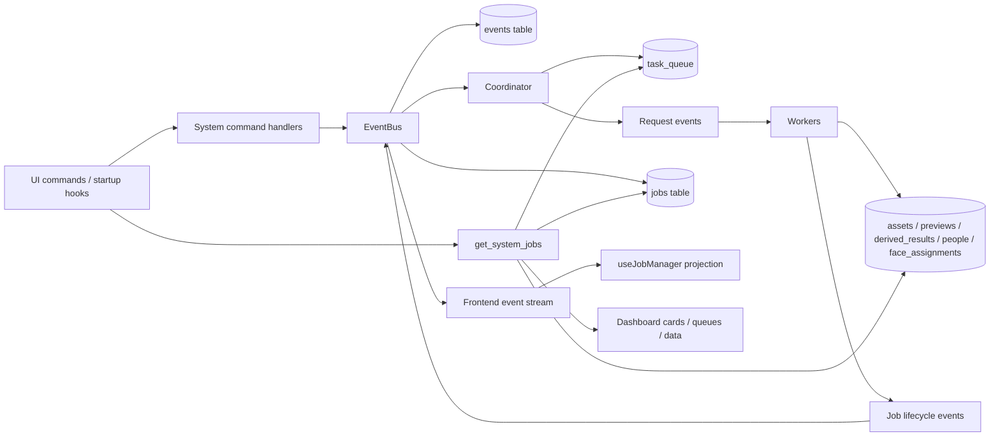

# Workflow and Jobs System - Current State

Last reviewed: 2026-03-08

## Status

This document describes the workflow and jobs system as it exists in the codebase today.

- It is a current-state technical reference, not a target-state spec.
- `docs/workflows.spec.md` and `docs/photo-star-jobs-spec.md` still capture design intent, but they do not exactly match the implementation anymore.
- For the current runtime behavior, treat the code and this document as canonical.

## Canonical source files

- `core/src/events/types.ts`
- `core/src/events/bus.ts`
- `core/src/coordinator/index.ts`
- `core/src/coordinator/workflows.ts`
- `core/src/coordinator/workflowModules.ts`
- `core/src/main.ts`
- `core/src/handlers/systemCommands.ts`
- `core/src/handlers/systemJobsCommands.ts`
- `src/hooks/useJobManager.ts`
- `src/components/DashboardView.tsx`

## High-level architecture

## Runtime responsibilities

### Event bus

- `EventBus.emit()` persists every domain event into the `events` table first.
- After persistence, the event bus dispatches synchronously to:
  - handlers subscribed to that exact event type
  - global `subscribeAll` handlers
- The event bus is in-process only. It is not a separate queue broker.

### Coordinator

- The `Coordinator` is the orchestration layer for queued workflow stages.
- It subscribes to all events with `subscribeAll(...)`.
- It resolves the active workflow definition from:
  - built-in workflow modules
  - optional runtime-registered workflow modules
  - `workflow_modules_json`
  - `workflow_stage_overrides_json`
- It mutates `task_queue` based on declarative transition rules.
- It evaluates queued work and emits request events for workers.
- It is also responsible for some cleanup behavior that is not fully declarative yet:
  - preview completion can trigger immediate re-evaluation
  - recognition completion cleans up stuck recognition rows and ensures clustering is queued
  - AI metadata completion/failure finalises queued rows in bulk

### Workers

- Workers are wired in `core/src/main.ts` as event subscribers.
- Most workers are activated by request events such as `PreviewRequested` or `AiMetadataRequested`.
- Some user commands still launch workers directly and bypass the coordinator queue.

### Monitoring and UI projections

- Job lifecycle events are projected into the `jobs` table.
- All domain events are forwarded to the frontend event stream.
- The frontend maintains a transient event-driven job list in `useJobManager`.
- The dashboard also polls `get_system_jobs` for aggregate snapshots of jobs, queues, issues, and data coverage.

## Persistence model

| Table | Role in workflow/jobs system | Notes |
| --- | --- | --- |
| `events` | Append-only event log | Stores the full event payload as JSON. |
| `jobs` | Persisted job lifecycle projection | Built from `JobStarted`, `JobProgress`, `JobCompleted`, `JobFailed`. |
| `task_queue` | Persistent coordinator queue | One row per `(media_id, pipeline_stage)`. |
| `processing_issues` | Asset-level warnings/errors | Used for per-asset failures that should not stop a batch. |
| `settings` | Workflow/runtime configuration | Includes workflow module and stage override JSON. |
| `assets` | Discovered media records | Created early during scan. |
| `previews` | Generated thumbnails and large previews | Used by later stages. |
| `derived_results` | Stage outputs | Stores `face_detection`, `face_recognition`, `ai_metadata`, pending AI re-analysis markers, and more. |
| `people` | Clustered people identities | Rebuilt by clustering logic today. |
| `face_assignments` | Face-to-person mapping | Rebuilt by clustering logic today. |

### Startup recovery

On sidecar startup:

- `task_queue.status = 'processing'` rows are reset back to `pending`
- `jobs.status = 'running'` rows are marked `failed`

This allows the queue to resume, but it does not reconstruct true in-flight worker state.

## Workflow definition model

The coordinator works from `StagePolicy` and `QueueTransitionRule` definitions.

### StagePolicy

Each stage policy defines:

- `stage`
- `order`
- `gate`
  - `strict`: later stages are blocked while this stage has active work
  - `opportunistic`: later stages can still proceed
- `activeCounter`
  - `task_queue`: active means `pending` or `processing` rows exist for the stage
  - `jobs_running`: active means a row exists in `jobs` with a matching ID pattern
- `jobsRunningLike`
- `batchLimit`
- `useHeavyBatching`
- `dispatch`

### QueueTransitionRule

Each transition rule defines:

- `eventType`
- optional `condition`
- one or more actions:
  - `queue_upsert`
  - `queue_complete`
- optional `triggerEvaluate`

### Built-in conditions

- `always`
- `auto_preview_on`
- `auto_preview_off`
- `face_count_positive`

### Evaluation behavior

The evaluation loop works like this:

1. If there are pending queue rows with `priority > 0`, dispatch those first.
2. Otherwise iterate stage policies by ascending `order`.
3. For media-batch stages:
   - fetch pending rows
   - optionally wait for heavy batching rules
   - mark rows `processing`
   - emit the request event
4. For signal stages:
   - if pending rows exist and the stage is not already active, emit the signal event
5. If a stage is `strict` and active, later stages are blocked.

### Heavy batching

Stages with `useHeavyBatching` share the same batching heuristic:

- dispatch immediately when queued count is `>= 3`
- otherwise wait until the first sighting is at least `2000 ms` old

This is currently fixed in code, not configured per stage.

## Current built-in workflow modules

These are the built-in modules defined in `core/src/coordinator/workflowModules.ts`.

### Stage policies

| Module | Stage | Order | Gate | Active counter | Running match | Batch limit | Heavy batching | Dispatch |
| --- | --- | --- | --- | --- | --- | --- | --- | --- |
| `ingest_previews` | `previews` | 10 | `strict` | `task_queue` | n/a | 100 | no | `PreviewRequested(reason: 'ingest')` |
| `face_pipeline` | `detection` | 20 | `strict` | `task_queue` | n/a | 100 | yes | `FaceDetectionRequested` |
| `face_pipeline` | `recognition` | 30 | `strict` | `task_queue` | n/a | 100 | yes | `FaceRecognitionRequested` |
| `face_pipeline` | `clustering` | 40 | `opportunistic` | `jobs_running` | `cluster-%` | n/a | no | `FaceClusteringRequested` |
| `safety_pipeline` | `sensitive_scan` | 50 | `opportunistic` | `jobs_running` | `sensitive-%` | 200 | yes | `SensitiveScanRequested` |
| `ai_metadata_pipeline` | `ai_metadata` | 60 | `opportunistic` | `jobs_running` | `ai_meta-%` | 100 | yes | `AiMetadataRequested` |

### Transition rules

#### `ingest_previews`

| Event | Condition | Actions |
| --- | --- | --- |
| `MediaDiscovered` | `auto_preview_on` | queue `previews` |
| `PreviewGenerated` | `always` | complete `previews` |

#### `face_pipeline`

| Event | Condition | Actions |
| --- | --- | --- |
| `MediaDiscovered` | `auto_preview_off` | queue `detection` |
| `PreviewGenerated` | `always` | queue `detection` |
| `FacesDetected` | `always` | complete `detection` |
| `FacesDetected` | `face_count_positive` | queue `recognition` |
| `FaceEmbeddingGenerated` | `always` | complete `recognition`, queue `clustering` |

#### `safety_pipeline`

| Event | Condition | Actions |
| --- | --- | --- |
| `MediaDiscovered` | `auto_preview_off` | queue `sensitive_scan` with priority `-10` |
| `PreviewGenerated` | `always` | queue `sensitive_scan` with priority `-10` |
| `SensitivityScored` | `always` | complete `sensitive_scan` |

#### `ai_metadata_pipeline`

| Event | Condition | Actions |
| --- | --- | --- |
| `MediaDiscovered` | `auto_preview_off` | queue `ai_metadata` with priority `-20` |
| `PreviewGenerated` | `always` | queue `ai_metadata` with priority `-20` |

There is no declarative completion rule for `ai_metadata` yet. Completion and failure are handled imperatively in the coordinator by marking all currently `processing` AI metadata rows as terminal.

## Workflow settings and extension points

### Settings

| Setting | Purpose |
| --- | --- |
| `workflow_generate_previews_on_ingest` | Controls whether `MediaDiscovered` goes to previews first or directly to later stages. |
| `workflow_modules_json` | Enables, disables, or restricts workflow modules. |
| `workflow_stage_overrides_json` | Overrides stage policy fields like order, batching, dispatch, or gating. |

### `workflow_modules_json`

Accepted shapes:

- array of module IDs, treated as `onlyModules`
- object with:
  - `onlyModules`
  - `enabledModules`
  - `disabledModules`

### `workflow_stage_overrides_json`

- Accepts a map keyed by stage name.
- Can override:
  - `order`
  - `gate`
  - `activeCounter`
  - `jobsRunningLike`
  - `batchLimit`
  - `useHeavyBatching`
  - `dispatch`

### Runtime module extension point

- `registerWorkflowModule(...)` and `listWorkflowModules()` exist.
- This allows additional modules to be registered in code at runtime.
- There is not yet a persisted user-defined module system.

## Current event catalog

The following event types are currently part of the `DomainEvent` union.

### Request and orchestration events

| Event | Key payload | Primary producers | Primary consumers / notes |
| --- | --- | --- | --- |
| `FolderScanRequested` | `folderId`, `scanSessionId` | system commands, startup auto-scan | Currently informational. Scan job is still launched directly by command/startup code. |
| `PreviewRequested` | `mediaIds`, `reason` | coordinator, manual preview rebuild | preview worker |
| `FaceDetectionRequested` | `mediaId?`, `mediaIds?` | coordinator | detection worker |
| `FaceRecognitionRequested` | `mediaIds?` | coordinator | recognition worker |
| `FaceClusteringRequested` | none | coordinator | clustering worker |
| `SensitiveScanRequested` | `mediaIds?` | coordinator | sensitive scan worker |
| `AiMetadataRequested` | `mediaIds?`, `jobId?` | coordinator, manual command | AI metadata worker |
| `ComputeHashesRequested` | none | manual/system command paths | grouping worker |
| `DuplicateGroupingRequested` | none | manual/system command paths | grouping worker |
| `VariantGroupingRequested` | none | manual/system command paths | grouping worker |
| `BurstGroupingRequested` | `jobId?` | manual/system command paths | grouping worker |

### Domain result events

| Event | Key payload | Primary producers | Primary consumers / notes |
| --- | --- | --- | --- |
| `MediaDiscovered` | `mediaId`, `filePath`, `width`, `height`, `scanSessionId` | scan job | coordinator transition rules |
| `PreviewGenerated` | `mediaId`, `path` | preview worker | coordinator transition rules |
| `PreviewFailed` | `mediaId`, `severity` | preview worker | persisted in events stream; not currently used for queue retries |
| `FacesDetected` | `mediaId`, `faceCount` | detection worker | coordinator transition rules, frontend metrics |
| `FaceEmbeddingGenerated` | `mediaId`, `faceId` | recognition worker | coordinator transition rules, frontend metrics |
| `FaceMatched` | `mediaId`, `faceId`, `personId`, `confidence` | defined in schema | currently defined but not part of the active face pipeline |
| `FaceClusteringUpdated` | `clusterId` | clustering worker | informational event after cluster persistence |
| `SensitivityScored` | `mediaId`, `score`, `tier` | sensitive scan worker | coordinator completes queue rows |
| `AssetUpdated` | `assetId` | AI metadata worker | backend re-queries asset and pushes full refreshed asset to frontend |
| `QuotaWarning` | `model`, `fallbackModel`, `reason`, `assetIds`, `pendingProCount` | AI metadata path | frontend notifications |
| `ProAnalysisPending` | `assetIds`, `proModel` | AI metadata path | frontend notifications and data stats |

### Job lifecycle and system events

| Event | Key payload | Primary producers | Primary consumers / notes |
| --- | --- | --- | --- |
| `JobStarted` | `jobId`, `pipelineStage`, `totalItems?` | workers, some command handlers | `jobs` table projection, frontend job list |
| `JobProgress` | `jobId`, progress fields | workers | `jobs` table projection, frontend job list |
| `JobCompleted` | `jobId`, `pipelineStage?` | workers, some command handlers | `jobs` table projection, coordinator re-evaluation |
| `JobFailed` | `jobId`, `severity`, `reason`, `pipelineStage?` | workers | `jobs` table projection, coordinator re-evaluation |
| `SystemPausedStateChanged` | `isPaused` | pause/resume commands | frontend pause state |

## Worker and job inventory

This is the current set of long-running or background-oriented workers connected to the workflow/jobs system.

| Worker | Trigger path | Job stage / ID style | Main writes | Main emitted events | Notes |
| --- | --- | --- | --- | --- | --- |
| `scan.ts` | direct from `scan_folder` command or startup auto-scan | stage `scan`, IDs like `scan-*` | `assets` | `JobStarted`, `MediaDiscovered`, `JobProgress`, `JobCompleted`, `JobFailed` | Emits `FolderScanRequested` too, but the scan job is not subscribed from that event today. |
| `previews.ts` | `PreviewRequested` | stage `previews`, IDs like `preview-batch-*` / `previews-*` | `previews`, `processing_issues` | `JobStarted`, `PreviewGenerated`, `PreviewFailed`, `JobProgress`, `JobCompleted` | Preview failures do not currently retry through queue policy. |
| `detect_faces.ts` | `FaceDetectionRequested` or direct manual run | stage `detection`, IDs like `detect-*` | `derived_results(task='face_detection')`, `processing_issues` | `JobStarted`, `FacesDetected`, `JobProgress`, `JobCompleted`, `JobFailed` | Also emits per-asset warning `JobFailed` events with synthetic IDs such as `detection-<assetId>`. |
| `recognise_faces.ts` | `FaceRecognitionRequested` or direct manual run | stage `recognition`, IDs like `recog-*` | `derived_results(task='face_recognition')` | `JobStarted`, `FaceEmbeddingGenerated`, `JobProgress`, `JobCompleted`, `JobFailed` | Batch cancellation/fatal paths do not always include `pipelineStage`. |
| `cluster_faces.ts` | `FaceClusteringRequested` or direct manual run | stage `analysis`, IDs like `cluster-*` | `people`, `face_assignments` | `JobStarted`, `FaceClusteringUpdated`, `JobProgress`, `JobCompleted` | Loads all embeddings, wipes all face assignments, rebuilds people, then regenerates person thumbnails. |
| `scan_sensitive.ts` | `SensitiveScanRequested` or direct manual run | stage `sensitive_scan`, IDs like `sensitive-*` | `assets.sensitivity_score`, `processing_issues` | `JobStarted`, `SensitivityScored`, `JobProgress`, `JobCompleted`, `JobFailed` | Scans thumbnail previews, not original files. |
| `get_metadata_ai.ts` | `AiMetadataRequested` or manual extraction command | stage `ai_metadata`, IDs like `ai_meta-*` or UI command ID | `derived_results(task='ai_metadata')`, pending-pro markers, `processing_issues` | `JobStarted`, `JobProgress`, `AssetUpdated`, `QuotaWarning`, `ProAnalysisPending`, `JobCompleted`, `JobFailed` | Manual and queued runs use the same worker. |
| `compute_hashes.ts` | `ComputeHashesRequested` or grouping pipeline | stage `similarity_cluster` | similarity feature tables | `JobStarted`, `JobProgress`, `JobCompleted` | Not part of coordinator modules. |
| `build_duplicate_groups.ts` | `DuplicateGroupingRequested` or grouping pipeline | stage `similarity_cluster` | grouping tables | `JobStarted`, `JobProgress`, `JobCompleted` | Not part of coordinator modules. |
| `build_variant_groups.ts` | `VariantGroupingRequested` or grouping pipeline | stage `similarity_cluster` | grouping tables | `JobStarted`, `JobProgress`, `JobCompleted` | Not part of coordinator modules. |
| `build_burst_groups.ts` | `BurstGroupingRequested` | stage `similarity_cluster` | grouping tables | `JobStarted`, `JobProgress`, `JobCompleted` | Not part of coordinator modules. |

## Current execution flows

### Ingest and enrichment

The main automatic flow is:

1. `scan_folder` starts `runScanJob(...)` directly.
2. The scan job inserts assets and emits `MediaDiscovered`.
3. The coordinator reacts to `MediaDiscovered`:
   - queue previews if `workflow_generate_previews_on_ingest != 'false'`
   - otherwise queue detection directly
   - also queue sensitive scan and AI metadata depending on preview mode
4. When previews are generated, `PreviewGenerated` advances later stages.
5. `FacesDetected` completes detection and, if faces exist, queues recognition.
6. `FaceEmbeddingGenerated` completes recognition rows and queues clustering rows.
7. Recognition completion also triggers coordinator cleanup that:
   - marks any still-processing recognition rows complete
   - inserts one clustering queue row if recognition data exists
8. Clustering runs as a signal stage rather than a per-asset batch stage.

### AI metadata

The AI metadata path is different from the face and preview pipelines:

- queue insertion is event-driven
- queue completion is not event-driven per asset
- when the AI metadata job finishes, the coordinator marks every `task_queue` row with:
  - `pipeline_stage = 'ai_metadata'`
  - `status = 'processing'`
  as either `completed` or `failed`

That means queue ownership is currently batch-wide, not row-owned.

### Manual commands that bypass the queue

Several commands still bypass the coordinator queue or use it only partially:

- `scan_folder`
- `detect_faces`
- `recognise_faces`
- `cluster_faces`
- `scan_sensitive`
- `scan_sensitive_force`
- `generate_previews`
- `extract_ai_metadata`
- `build_groups`
- `build_bursts`

This matters because queue visibility and job visibility are not the same thing in the current system.

## Monitoring and dashboard surfaces

### Persisted state

The backend currently exposes visibility through four different stores:

| Store | What it shows | Current weakness |
| --- | --- | --- |
| `events` | full append-only event history | no correlation IDs, no indexed causation chain, payload is opaque JSON |
| `jobs` | job lifecycle projection | depends on consistent `Job*` events and job ID naming |
| `task_queue` | stage queue state | no retry metadata, no owner/batch identity, no per-attempt history |
| `processing_issues` | asset-level failures | disconnected from queue attempts and job batches |

### Dashboard tabs

The dashboard currently has three tabs:

| Tab | Data source | What it shows |
| --- | --- | --- |
| `Modules` | `get_system_jobs` plus transient event jobs | aggregate cards such as onboarding, previews, detection, recognition, clustering, sensitive scan, AI metadata |
| `Queues` | `task_queue` plus running job counts | pending, processing, completed, failed, worker count, oldest age, sample processing media IDs |
| `Data` | aggregate queries over domain tables | photo count, people count, AI metadata coverage, face match coverage, detected/matched/unmatched faces, pending pro analysis |

### System job cards

`get_system_jobs` builds module cards by job ID prefixes:

- `scan-%`
- `previews-%`
- `detect-%`
- `recog-%`
- `cluster-%`
- `sensitive-%`
- `ai_meta-%`

This is convenient but heuristic. It is not a first-class execution model.

### Frontend event-driven jobs

`useJobManager` maintains a transient job list driven by event stream updates.

- `JobStarted` creates a visible job if none exists
- `JobProgress` updates the projection
- `JobCompleted` and `JobFailed` mark terminal state
- `FacesDetected` and `FaceEmbeddingGenerated` increment face metrics

This projection has important limits:

- if a job never emits `JobStarted`, it will not exist in the list
- asset-level warning `JobFailed` events with synthetic IDs do not map cleanly to batch jobs
- display titles depend on stage names and ID prefixes rather than explicit metadata

## Current design strengths

- The queue is persistent in SQLite rather than in-memory.
- The workflow module model is more declarative than the earlier hard-coded coordinator.
- Files become visible early through scan-time asset insertion.
- The event log, jobs table, queue snapshot, and processing issues already give four useful monitoring angles.
- The dashboard now exposes queue and data coverage, not only job cards.
- Workflow configuration can already be changed at runtime through settings.

## Current limitations and risks

### Visibility and observability

- There is no durable concept of workflow run, stage run, or batch run.
- `jobs` and `task_queue` are separate projections with no shared execution ID.
- The dashboard still infers system state from job ID prefixes and aggregate counts.
- The event log has no correlation ID or causation ID chain.
- Queue rows do not record which worker batch claimed them.
- The frontend mixes two different monitoring models:
  - polled aggregate cards
  - transient event-driven jobs

### Error handling

- `JobFailed` is used for both batch failures and per-asset warnings.
- `pipelineStage` is optional on `JobCompleted` and `JobFailed`, so downstream logic has to guess.
- AI metadata completion/failure is applied to all currently processing rows for the stage, not the specific dispatched batch.
- The queue has no built-in retry counters, retry scheduling, or dead-letter state.
- `PreviewFailed` is persisted as an event but not used for structured queue retry behavior.
- Stale recovery on startup is coarse: queue rows go back to pending, running jobs become failed.

### Performance

- The coordinator re-runs multiple count queries on `task_queue` and `jobs` during evaluation.
- Heavy batching thresholds are fixed and shared across very different workloads.
- Face clustering loads all recognition embeddings, wipes all assignments, and rebuilds global people state on every run.
- AI metadata auto mode scans for all assets without `ai_metadata`, which will get more expensive as the library grows.
- All event persistence happens inline in the same process before handlers run.

### Monitoring and operations

- There is no heartbeat or stall detector for long-running workers.
- There is no queue row drill-down showing last error, last attempt time, or owner batch.
- There is no UI for active workflow module selection, loaded stage overrides, or parse warnings.
- There is no per-stage service level view such as throughput trend, retry trend, or tail latency.

### Architectural consistency

- Some jobs are workflow-managed, some are direct command-launched, and some are hybrid.
- Clustering is modelled as stage `clustering` in the queue but emits `pipelineStage: 'analysis'` in job lifecycle events.
- `FolderScanRequested` exists as an event but scan execution is still started directly by command code.
- Grouping pipelines use job lifecycle events, but they are not represented as workflow modules today.

## Suggested improvements

### 1. Create a first-class execution model

Add durable execution tables such as:

- `workflow_runs`
- `stage_runs`
- `stage_run_items`

Each dispatched batch should have:

- `execution_id`
- `stage`
- `trigger_type`
- `trigger_id`
- `claimed_at`
- `started_at`
- `finished_at`
- `status`
- `attempt`
- `last_error`

This would give the queue, jobs table, and dashboard a common identity model.

### 2. Give queue rows batch ownership and retry state

Extend `task_queue` or add a companion table with:

- `attempt_count`
- `available_at`
- `claimed_by`
- `claimed_at`
- `last_error`
- `last_error_at`
- `last_transition_event_id`

This would fix the current AI metadata stage-wide finalisation problem and make retries explicit.

### 3. Introduce stage lifecycle events

Keep the generic `Job*` events for UI if needed, but add explicit orchestration events such as:

- `StageQueued`
- `StageClaimed`
- `StageDispatched`
- `StageProgressed`
- `StageCompleted`
- `StageFailed`
- `StageRetried`

Each should carry:

- `executionId`
- `stage`
- `mediaIds`
- `causeEventId`
- `moduleId`

That would make workflow monitoring much more concrete than job ID prefixes.

### 4. Normalize event contracts

Make these changes consistently:

- require `pipelineStage` on all `JobCompleted` and `JobFailed` events
- stop using `JobFailed` for per-asset warnings
- use a dedicated asset-level issue event for warning cases
- include `correlationId` and `causationId` on all domain events

This would simplify both dashboard logic and debugging.

### 5. Unify manual execution with the coordinator

Route manual actions through the same orchestration path whenever possible:

- manual preview rebuild
- manual AI metadata extraction
- manual sensitive scan
- manual detection/recognition/clustering
- grouping runs

The command layer should request workflow work, not decide ad hoc execution style.

### 6. Improve monitoring surfaces

Add backend APIs and UI surfaces for:

- active workflow modules and resolved stage policies
- parse warnings from workflow settings
- stage queue drill-down
- stalled job detection
- last transition reason per queue row
- recent event timeline for a stage or asset
- top failing assets and top failing error categories

Also move more monitoring to push-based updates instead of `1s` to `3s` polling.

### 7. Add stall detection and heartbeats

Workers should periodically update:

- heartbeat timestamp
- current item
- recent throughput window

The coordinator or a watchdog can then mark work as stalled and either retry or alert.

### 8. Make batching and concurrency policy explicit

The current `>= 3 or wait 2s` heuristic is too generic. Move toward per-stage policy fields like:

- `minBatchSize`
- `maxBatchDelayMs`
- `maxConcurrentRuns`
- `maxConcurrentItems`
- `cpuWeight`
- `gpuWeight`

This will matter once multiple heavier modules run together.

### 9. Rework face clustering to be incremental

Current clustering is still global rebuild logic. A better model would:

- only re-cluster affected faces or affected people
- preserve stable person IDs more deliberately
- record merge/split history
- avoid wiping all face assignments on each run

This is both a performance and observability improvement.

### 10. Make documentation split explicit

Maintain two documentation classes:

- current-state docs like this file
- target-state specs for proposed refactors

That prevents the dashboard and workflow design from drifting into undocumented hybrid behavior again.

## Recommended next implementation sequence

1. Add execution IDs and queue ownership to dispatched batches.
2. Normalize `Job*` events and stop using them for asset-level warnings.
3. Expose resolved workflow module config and warnings in `get_system_jobs`.
4. Add retry metadata and stall detection to queue processing.
5. Unify manual commands under the coordinator.
6. Replace global face clustering rebuild with incremental clustering.
